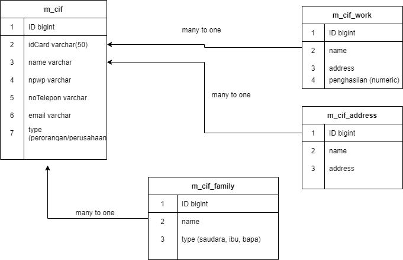

# CIF PROJECT

## Requirement

- CRUD m_cif
- CRUD m_cif_work
- CRUD m_cif_family
- CRUD m_cif_address

<b> CRUD m_cif on create / update </b>

- name mandatory
- email optional
- id_ktp mandatory, unique
- no_telepon mandatory, unique,
- npwp unique, mandatory if type == COMPANY else Optional

<b> CRUD m_cif_work on create / update </b>

- m_cif_id mandatory
- constraint maximum 1 m_cif_id has 5 m_cif_work_work

<b> CRUD m_cif_family on create / update </b>

- m_cif_id mandatory

<b> CRUD m_cif_address on create / update </b>

- m_cif_id mandatory